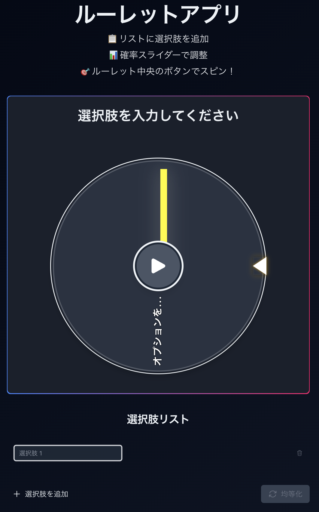

# Web Roulette Ex

ブラウザで実行できるカスタマイズ可能なルーレットアプリケーションです．複数の選択肢と確率の重みを設定して，ランダムな結果を得ることができます．



## 🌟 特徴と強み

- **確率調整機能** - <u>他のWebルーレットアプリでは珍しい</u>重み付け機能を搭載．スライダーで各選択肢の確率を0.1%単位で細かく調整可能（他のアプリでは実現できない精度）
- **直感的な確率設定インターフェース** - 視覚的なスライダーで簡単かつ正確に確率を調整できる珍しいWebルーレットアプリ
- **スマートな重み分配** - 選択肢を追加・削除・編集した際に確率が自動調整されます
- **確率均等化ワンクリック機能** - 全ての選択肢の確率を瞬時に均等に設定できます
- **レスポンシブ対応** - すべてのデバイスで最適な表示と操作性を実現

## 💻 使い方

1. リストに選択肢を追加（無制限に追加可能）
2. 各選択肢の確率をスライダーで調整
3. ルーレット中央のボタンをクリックしてスピン！
4. 結果を確認

## 🔧 技術スタック

- [Next.js 15](https://nextjs.org/) - 最新のReactフレームワーク
- [React 19](https://reactjs.org/) - 最新のUIライブラリ
- [TypeScript](https://www.typescriptlang.org/) - 型安全なコーディング
- [Tailwind CSS](https://tailwindcss.com/) - CSSフレームワーク
- [Framer Motion](https://www.framer.com/motion/) - 高度なアニメーション

## ⚙️ 開発環境のセットアップ

```bash
# リポジトリのクローン
git clone https://github.com/keitao7gawa/web-roulette-app.git
cd web-roulette-app

# 依存関係のインストール
npm install

# 開発サーバーの起動
npm run dev
```

ブラウザで [http://localhost:3000](http://localhost:3000) を開いてアプリケーションを確認できます．

## 🤝 貢献方法

1. このリポジトリをフォーク
2. 機能ブランチを作成 (`git checkout -b feature/amazing-feature`)
3. 変更をコミット (`git commit -m 'feat: 素晴らしい機能を追加'`)
4. ブランチをプッシュ (`git push origin feature/amazing-feature`)
5. プルリクエストを作成

## 📝 今後の計画

- 確率プリセットの保存と共有
- 結果のエクスポート機能


## 📜 ライセンス

[MIT License](LICENSE)

## 👏 謝辞

- アイコンに [Heroicons](https://heroicons.com/) を使用させていただきました．  
- 開発に [Cursor IDE](https://cursor.sh/) を活用しました．
- 開発に関する貴重なアドバイスをくださった [Yumekawa-chan](https://github.com/Yumekawa-chan) さんに心より感謝いたします．

## 🔗 リンク

- 公式サイト: [https://www.web-roulette-ex.jp/](https://www.web-roulette-ex.jp/)
- GitHub: [https://github.com/keitao7gawa/web-roulette-app](https://github.com/keitao7gawa/web-roulette-app)
- 作者Twitter: [@keitao7gawa](https://twitter.com/keitao7gawa)
